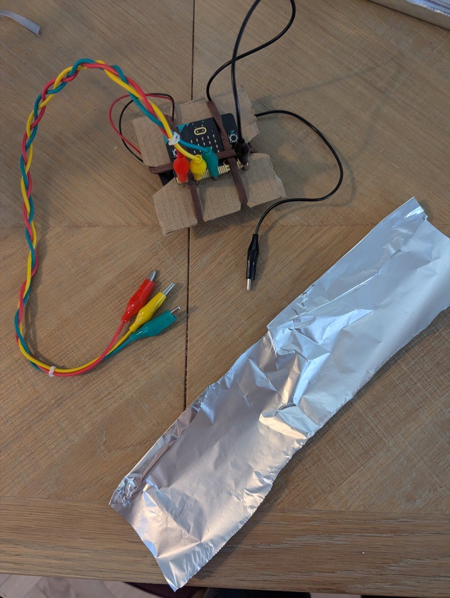

## What you will make

Build a finger-controlled memory game with a BBC micro:bit and switches made from everyday materials.

> [!NOPRINT]
>
> <html>
> 

> <iframe style="position: absolute; top: 0; left: 0; right: 0; width: 100%; height: 100%; border: none;" src="https://www.youtube.com/embed/g3qdMucsHjQ?rel=0&cc_load_policy=1" allowfullscreen allow="accelerometer; autoplay; clipboard-write; encrypted-media; gyroscope; picture-in-picture; web-share">
> </iframe>
> 
 
> </html>

The micro:bit generates a five-number reboot code using the numbers `1` to `3` and displays it once. Repeat the code by tapping the matching finger contacts against a thumb contact:

- Index finger: `P0`, which enters `1`
- Middle finger: `P1`, which enters `2`
- Ring finger: `P2`, which enters `3`
- Thumb: `GND`, the common contact

Every accepted touch briefly shows the number detected. A mistake produces a warning honk. Repeating all five signals correctly produces two beeps and completes the reboot.

### You will need

- A BBC micro:bit V2
- A USB data cable
- A battery pack and two AAA batteries
- Four crocodile or alligator clip leads
- Kitchen foil
- Thin card, such as a cereal box or a piece of cardboard
- Three or four elastic bands or hair bands
- Ordinary tape
- Scissors

You will connect, code and test the loose leads before making anything for your fingers. This keeps your hands free while you work at the computer.

> [!INFO]
>
> **Safety:** Never connect the `3V` and `GND` rings together. Later, wrap every foil contact loosely enough to pull off straight away, and keep the wrist fastening loose enough to stay comfortable.
