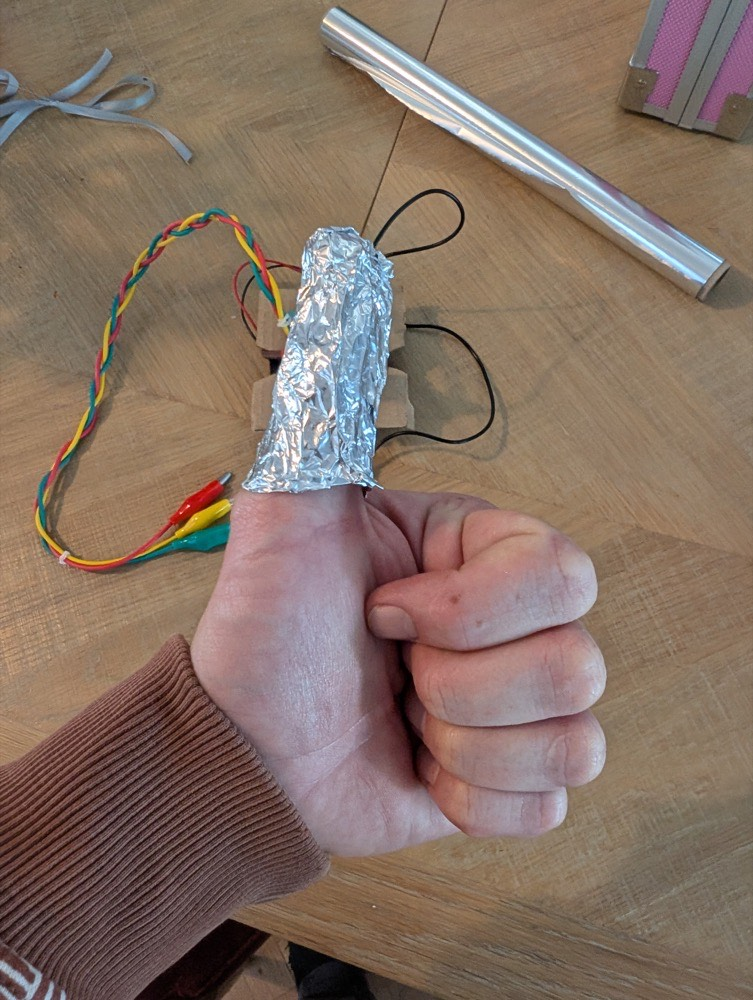
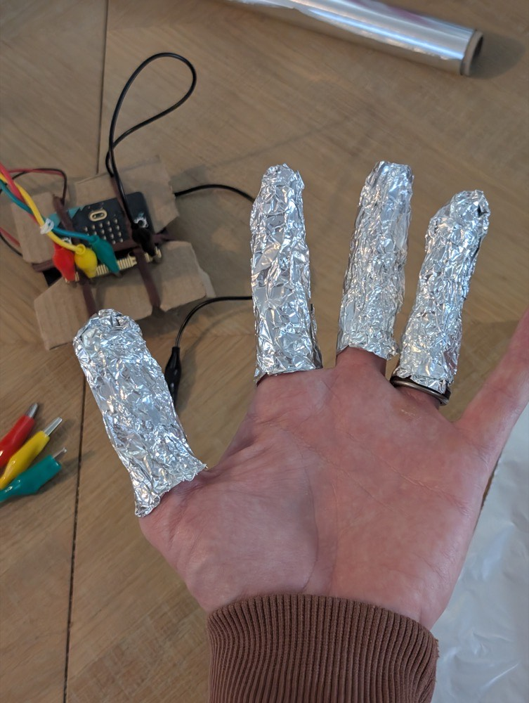
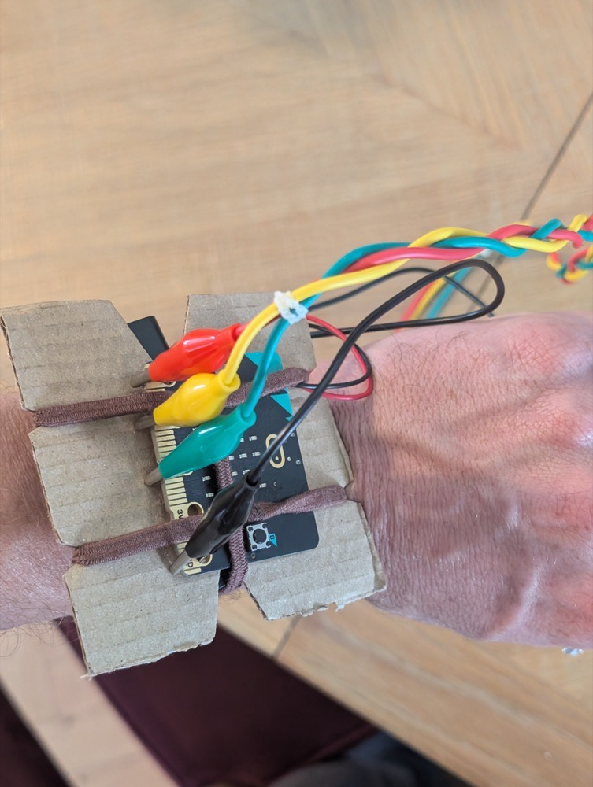
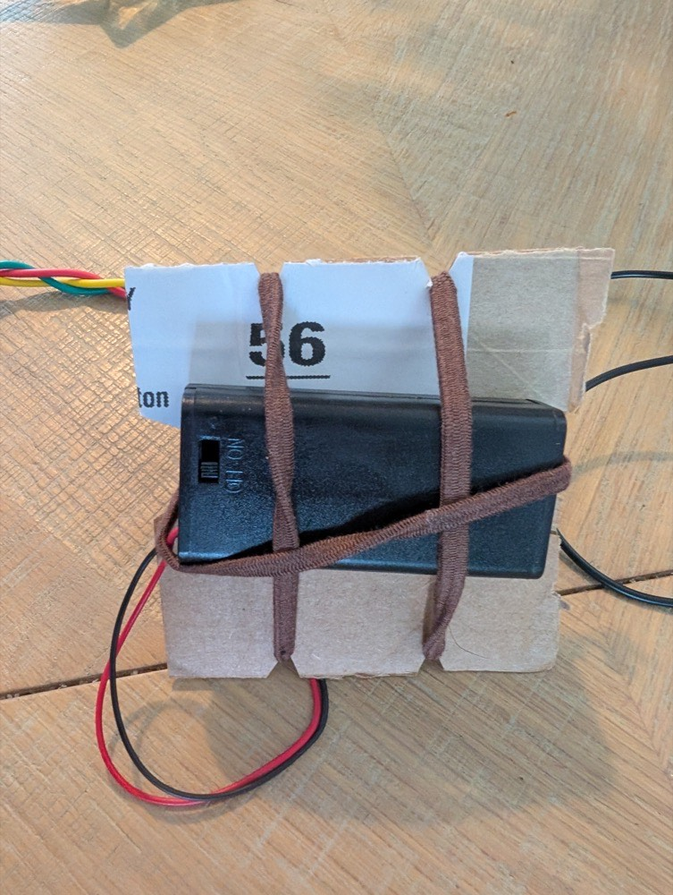

## Build the wearable controls

Now that the complete game works with bare leads, make the finger contacts and secure the micro:bit.

> [!TASK]
>
> Tear off four small pieces of kitchen foil. Wrap one loosely around your thumb and one around each of your index, middle and ring fingers, leaving enough foil near the base of each finger for a crocodile clip to grip. Decide now which finger is `1`, `2` and `3`, and use a different lead colour for each one so you can tell them apart.
>
> 
>
> 

> [!TASK]
>
> Cut a piece of thin card a little larger than the micro:bit. Hold the micro:bit against the card with elastic bands, then hold the battery pack against the other side of the card in the same way. Use one more elastic band, or the card itself, to keep the whole thing comfortably on your wrist with the LED display, buttons and edge connector visible and reachable.
>
> 
>
> 

**Test:** Put on and remove every foil contact. Each must come off immediately without pulling. Hold your arm in a comfortable playing position for 30 seconds; the micro:bit should stay in place without the fastening feeling tight.

> [!INFO]
>
> **Safety:** If a foil contact or the wrist fastening feels tight, take it off and loosen it before playing. Nothing should need pulling to come free.
