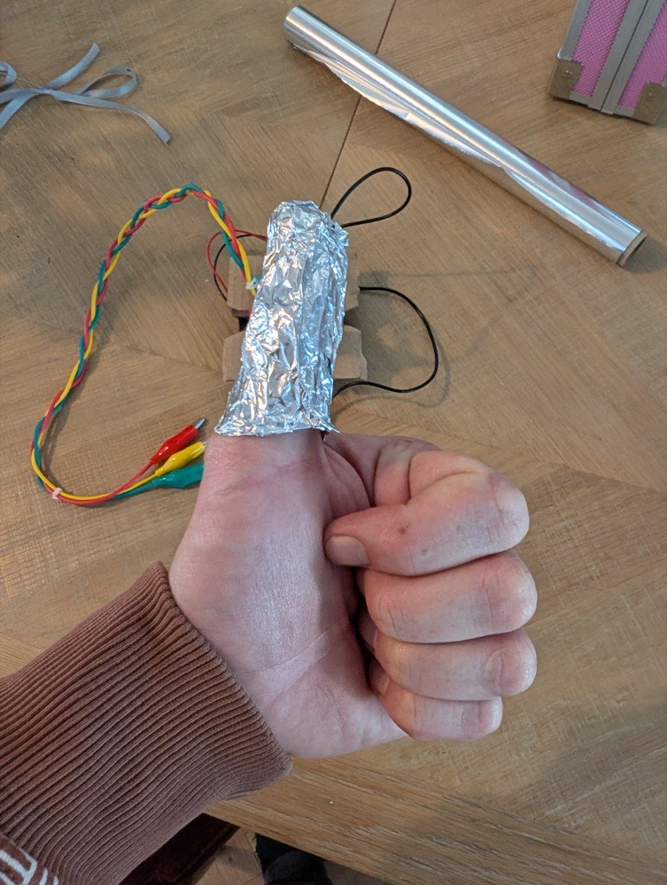
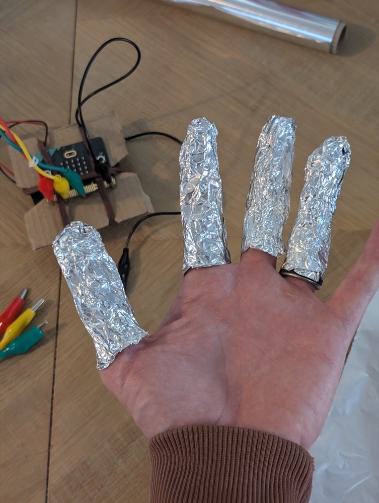
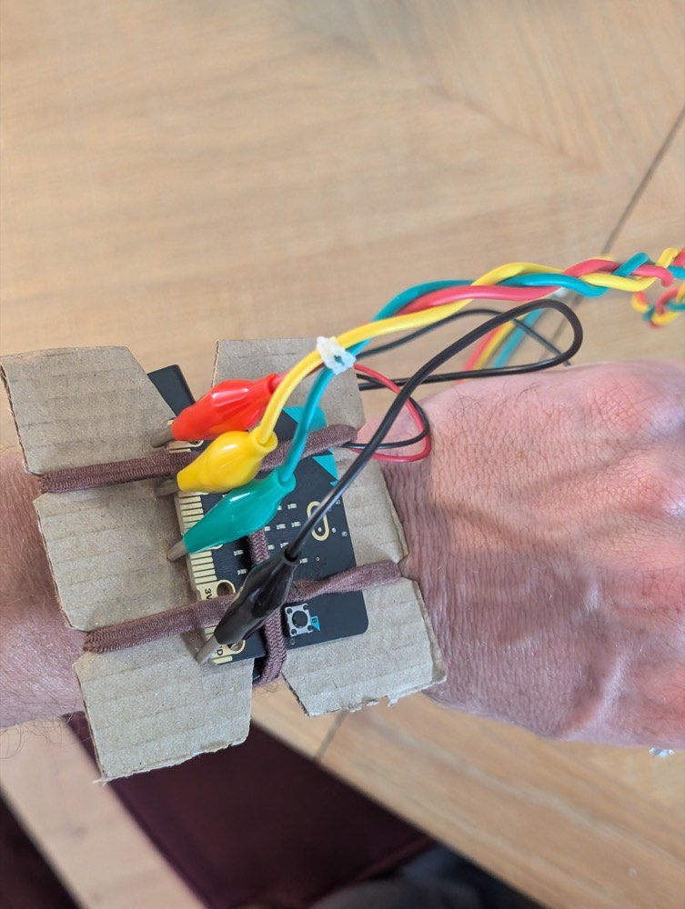
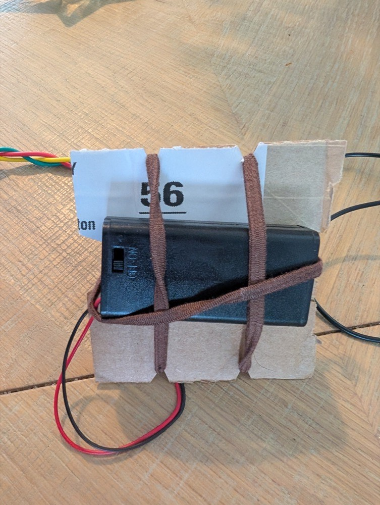

## Build the wearable controls

Now that the complete game works with bare leads, make the finger contacts and secure the micro:bit.

> [!TASK]
>
> Tear off four small pieces of kitchen foil. Wrap one loosely around your thumb and one around each of your index, middle and ring fingers, leaving enough foil near the base of each finger for a crocodile clip to grip.
>
> Every finger needs its own separate piece of foil, and no piece should touch another. Stop each wrap before the knuckle where your finger joins your hand, because your fingers press together there.
>
> Your index finger will enter `1`, your middle finger `2` and your ring finger `3`, as listed in step 1.
>
> 
>
> 

> [!TASK]
>
> Cut a piece of thin card a little larger than the micro:bit. Snip a small notch into the edge of the card wherever an elastic band will cross it, so the band sits in the notch and cannot slide off. Hold the micro:bit against the card with elastic bands, then hold the battery pack against the other side of the card in the same way. Use one more elastic band, or the card itself, to keep the whole thing comfortably on your wrist with the LED display, buttons and edge connector visible and reachable.
>
> 
>
> 

**Test:** Put on and remove every foil contact. Each must come off immediately without pulling. With your hand relaxed, check that no two pieces of foil touch. Hold your arm in a comfortable playing position for 30 seconds; the micro:bit should stay in place without the fastening feeling tight.

> [!INFO]
>
> **Safety:** If a foil contact or the wrist fastening feels tight, take it off and loosen it before playing. Nothing should need pulling to come free.
