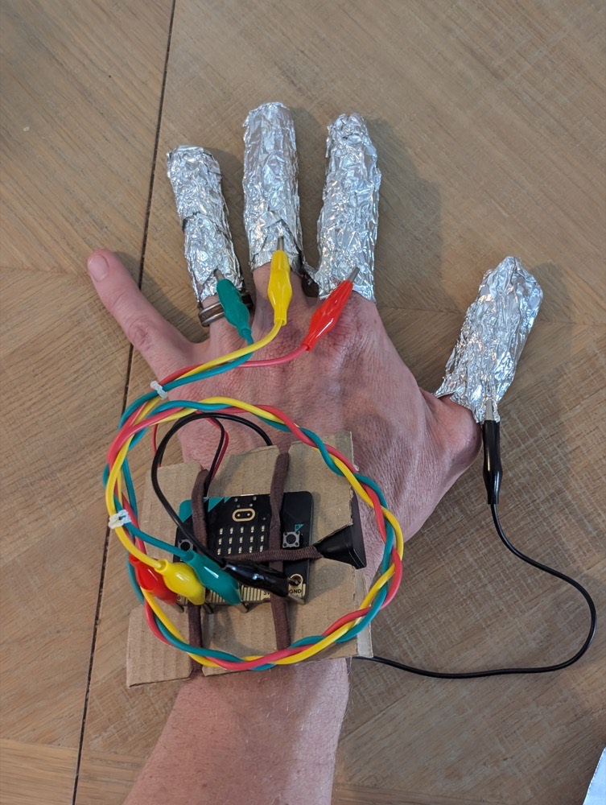
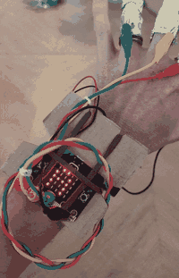
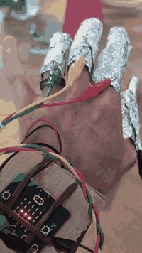

## Connect and test the controller

Attach the already-tested leads to the wearable contacts.

> [!TASK]
>
> Disconnect all power. Connect `GND` to the thumb contact, `P0` to finger `1`, `P1` to finger `2`, and `P2` to finger `3`. Clip each lead onto the foil near the base of the finger.
>
> 

> [!TASK]
>
> Connect the battery pack and press A. Watch the five-signal code, then tap each matching finger contact against the thumb contact. Separate the contacts after every tap.
>
> 

**Test:** Play several new codes until each numbered finger has appeared. Check that every tap displays the number detected, a wrong input honks once, and five correct inputs beep twice and complete the reboot. The wrist fastening and foil contacts should remain comfortable throughout.

This is what a correctly wired controller looks like with every contact checked in turn.

> [!SAVE]
