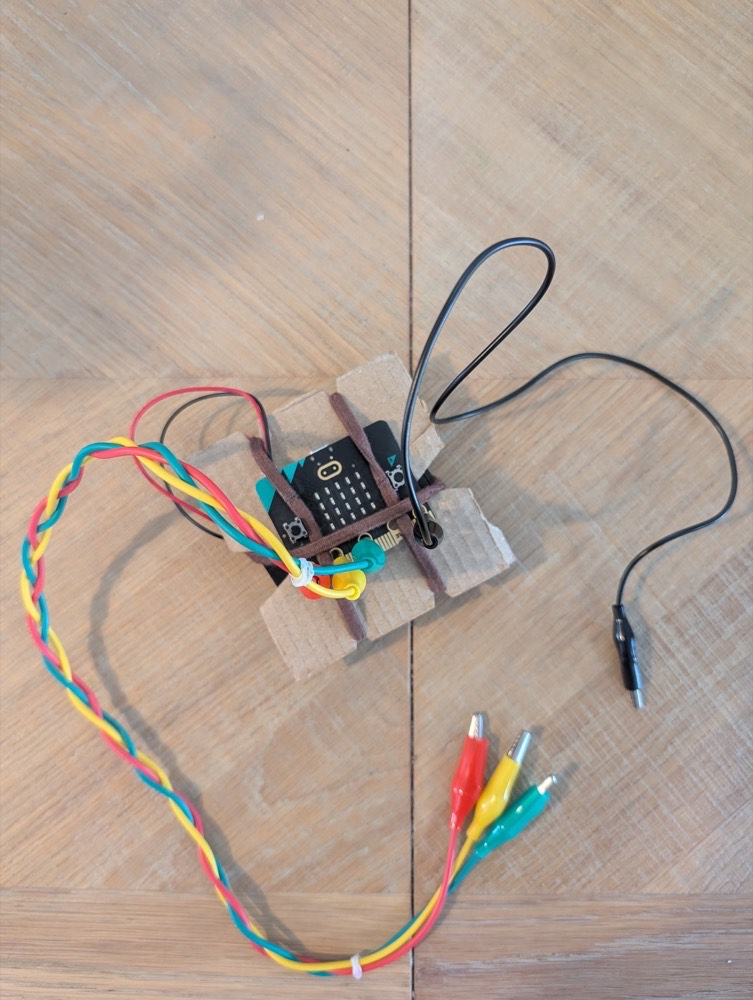

## Start the controller

Create the MakeCode project, then connect the first pair of test leads.

> [!TASK]
>
> Open [Microsoft MakeCode for micro:bit](https://makecode.microbit.org/){:target="_blank"} and create a project called `Reboot Sequence`.
>
> In `on start`, show the string `A`. Download the program to your micro:bit.
>
> ```blocks
> basic.showString("A")
> ```

> [!TASK]
>
> Disconnect the USB cable and battery pack. Connect one crocodile lead to `GND`, one to `P0`, one to `P1` and one to `P2`. Arrange the four free metal jaws so they cannot touch each other accidentally.
>
> 

**Test:** Reconnect USB and reset the micro:bit. `A` should appear and stay on the display. Gently move each lead; they should remain attached to the correct rings without touching `3V` or a neighbouring ring.
